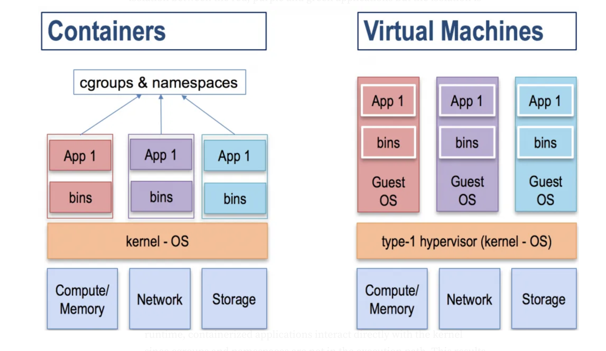

# Containerisation Demo

### How does containerisation work?
I made this repo to learn how containerisation works by building a minimal container runtime from scratch in Go. This demonstrates how containers differ from virtual machines at a fundamental level.

**The key insight**: A container is simply a process that has been isolated from other processes using Linux kernel features called namespaces and cgroups.

### What my implementation demonstrates:

**Namespaces** provide isolation by limiting what a process can "see":
- **UTS namespace**: Gives the container its own hostname (`container123`)
- **PID namespace**: The container sees its own process tree (PID 1 inside the container)
- **Mount namespace**: Isolates the filesystem view
- **User namespace**: Maps container root (UID 0) to the host user

**Cgroups** limit the resources a process can consume:
- CPU throttling: Container gets max 50% of one CPU core (50ms out of every 100ms)
- Process tracking: All container processes are grouped together

**Filesystem isolation**:
- `chroot` changes the root directory to `alpine_fs`
- `/proc` is mounted to give the container its own process information

### Container vs Virtual Machine:

**Containers** (what I built):
- Share the host OS kernel
- Use kernel namespaces and cgroups for isolation
- Are just isolated processes
- Lightweight and fast to start

**Virtual Machines**:
- Run their own complete operating system
- Use a hypervisor to virtualize hardware resources
- Much heavier resource overhead
- Complete isolation at the hardware level



### How my container works:
1. Parent process creates child with new namespaces
2. Child process sets up its isolated environment (hostname, filesystem, /proc)
3. Parent process configures cgroups to limit resources
4. Container executes the requested command in this isolated environment

**TLDR:**
- Namespaces limit what you can see (hostname, processes, filesystem)
- Cgroups limit what resources you can use (CPU, memory)
- My code demosntrates that containers are just isolated processes, not mini-VMs!

### How to Run It

**Prerequisites:**
- Linux system (required for namespaces and cgroups). I used VMware Fusion with Alpine Linux since I'm on an Apple machine.
- Go installed
- Root/sudo access (needed for namespaces and cgroups operations)
- An `alpine_fs` directory with a minimal filesystem. I got one from https://www.alpinelinux.org/downloads/

**Build and run:**
```bash
# Build the container runtime
make build

# Run a shell in the container
sudo ./container /bin/sh

# Or with any other command available in your alpine_fs
sudo ./container /bin/cat /etc/hostname
```


### Understanding the `-r` (Reexec) Flag

One of the key concepts in my container implementation is the **reexec pattern**, which is how the program bootstraps itself into the container environment.

**How it works:**
```bash
# When you run this:
sudo ./container /bin/sh

# The program actually does this internally:
# 1. Parent process (without -r): Sets up namespaces and cgroups
# 2. Child process (with -r): Runs inside the new namespaces and sets up the container environment